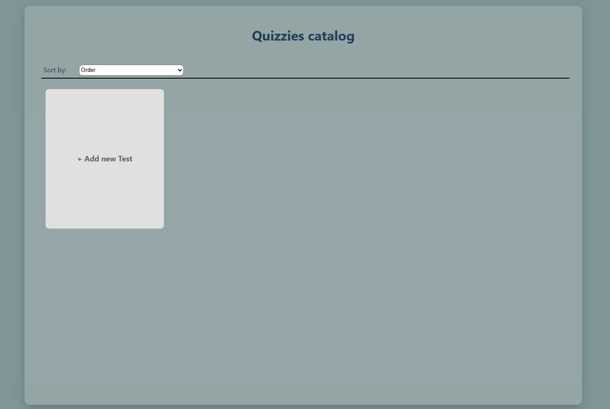

# 🎯 Quizz - Application  

📌 **Прототип додатку для створення тестів**  

> Через брак досвіду багато чого не встиг, багато чого довелось вивчити за ці 3 дні і використати вперше.  
> Через брак часу вирішив не реалізовувати бекенд і зробити у рамках SPA.  
> Формально виконав у термін **3 доби**. Скільки зміг.  

---
## 📷 Прев'ю

## 🚀 Що реалізовано  

✅ Основна логіка створення та проходження тестів  
✅ Сортування та зберігання між сесіями  
✅ Drag&drop у будь-яких варіантах  
✅ Покращена pagination у вигляді Infinite Scroll  
✅ Збереження даних у локальному сховищі (без бекенду)  
✅ Базова аналітика: кількість проходжень, середній час  
  

---

## ❌ Що не встиг  

🔸 Валідація та обробка текстових відповідей  
🔸 Розширена аналітика (графіки, статистика тестів)  

---

## 📷 Пруф 😊  

  

---

### 🛠️ Технології  

- **React** (фронтенд)  
- **Zustand** (стан) 
- **indexedDb** (сторейдж)
- **dnd-kit** (drag & drop)  
- **Vite** (збірка)  

📌 _Проект розроблений у навчальних цілях._  
